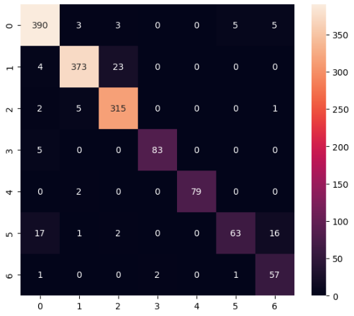
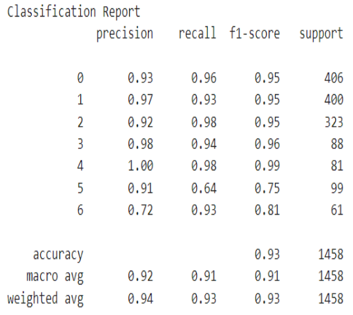

<br> ️*_This utilizes Kazuhito Takehashi's hand gesture recognition: [original repo](https://github.com/Kazuhito00/hand-gesture-recognition-using-mediapipe)._*
<br> 


This repository contains the following contents.
* Sample program
* Hand sign recognition model(TFLite)
* Finger gesture recognition model(TFLite)
* Learning data for hand sign recognition and notebook for learning
* Learning data for finger gesture recognition and notebook for learning

# Hand Gesture/Sign Recognition
This sample program recognizes hand signs and finger gestures with a simple MLP using the detected key points. In addition, it builds its model by utilizing a linear stack of layers, which takes the output of a previous layer and uses it as an input for the next in a sequential fashion.
Input layer: Accounts for 21 features, which also account for sets of 2 for each feature
Output layer:  Regularization technique, Dropout, to randomly set 20% of inputs to 0. This reduces dependency and promotes redundancy.

# Redundancy
Redundancy, in this context, means that multiple pathways in the network can contribute to the same or similar features. This can improve the generalization of the model because it becomes less sensitive to the precise configuration of neurons. The model is better equipped to recognize features in various forms or contexts.

# Classes
0. Open
1. Close
2. Point
3. Ok
4. Thumbs Up
5. Three Fingers
6. Four Fingers
   
# Confusion Matrix
Confusion Matrix           |  Classification Report
:-------------------------:|:-------------------------:
<br><be> |  <br><be>

A **confusion matrix** is a table that is often used to evaluate the performance of a classification model on a set of data for which the true values are known. 

**Precision:** The ratio of correctly predicted positive observations to the total predicted positives (TP / (TP + FP)). It measures the accuracy of positive predictions. 

**Recall:** The ratio of correctly predicted positive observations to all observations in the actual class (TP / (TP + FN)). It measures the ability of the model to capture all the relevant cases. 

**F1 Score:** The harmonic mean of precision and recall, providing a balance between the two metrics. 

**Support:** The number of actual occurrences of each class in the specified dataset.

## Analysis
**Class-wise Performance:**
> Classes 0, 1, 2, and 4 have high precision, recall, and F1 scores, suggesting good performance.
> Class 5 has lower precision, recall, and F1-score, indicating potential challenges in predicting this class accurately.
> Class 6 has lower precision and F1-score, but a higher recall, suggesting the model is better at capturing instances of this class.
> Though Class 5 and 6 have less support, a plethora of trials were conducted where they presented additional support; however, the same issue occurred. 

**Overall Performance:**
> The model has an overall accuracy of 93%, which is a good sign.
> Macro-average and weighted-average metrics provide an overall assessment. They are close, indicating a balanced dataset.

**Recommendations:**
> Exploring techniques such as adjusting class weights, tuning hyperparameters, or using different algorithms to improve the model's performance, especially for challenging classes.
> Experiment with various fractions for regularization

# Errors 
Three Fingers              |  Four Fingers
:-------------------------:|:-------------------------:
<br><be> |  <br><be>

**Note:** Recognition of Four Fingers occurred reliably only when positioned in a manner resembling the top of a circle.

## Feature Design
The features used to train the model may not capture the nuances that differentiate classes 5 and 6, despite regularization.

## Model
The model architecture may not be sufficiently complex to learn the intricate patterns that differentiate between classes 5 and 6. 

# Requirements
* mediapipe 0.8.1
* OpenCV 3.4.2 or Later
* Tensorflow 2.3.0 or Later<br>tf-nightly 2.5.0.dev or later (Only when creating a TFLite for an LSTM model)
* scikit-learn 0.23.2 or Later (Only if you want to display the confusion matrix) 
* matplotlib 3.3.2 or Later (Only if you want to display the confusion matrix)

# Demo
Here's how to run the demo using your webcam.
```bash
python app.py
```
### app.py
This is a sample program for inference.<br>
In addition, learning data (key points) for hand sign recognition,<br>
You can also collect training data (index finger coordinate history) for finger gesture recognition.

### keypoint_classification.ipynb
This is a model training script for hand sign recognition.

### point_history_classification.ipynb
This is a model training script for finger gesture recognition.

### model/keypoint_classifier
This directory stores files related to hand sign recognition.<br>
The following files are stored.
* Training data(keypoint.csv)
* Trained model(keypoint_classifier.tflite)
* Label data(keypoint_classifier_label.csv)
* Inference module(keypoint_classifier.py)

### model/point_history_classifier
This directory stores files related to finger gesture recognition.<br>
The following files are stored.
* Training data(point_history.csv)
* Trained model(point_history_classifier.tflite)
* Label data(point_history_classifier_label.csv)
* Inference module(point_history_classifier.py)

### utils/cvfpscalc.py
This is a module for FPS measurement.

# Training
Hand sign recognition and finger gesture recognition can add and change training data and retrain the model.

The model is trained on a dataset represented by X_train and y_train, which contain input features and corresponding labels, respectively. The training process involves iterating over the entire dataset for a specified number of epochs (in this case, 1000 epochs) and updating the model's weights based on the optimization of a chosen loss function. The training is performed in batches of 128 samples at a time, enhancing computational efficiency and memory usage. 

### Hand sign recognition training
#### 1.Learning data collection
Press "k" to enter the mode to save key points（displayed as 「MODE:Logging Key Point」）<br>
<br><br>
If you press "0" to "9", the key points will be added to "model/keypoint_classifier/keypoint.csv" as shown below.<br>
1st column: Pressed number (used as class ID), 2nd and subsequent columns: Key point coordinates<br>
<br><br>
The key point coordinates are the ones that have undergone the following preprocessing up to ④.<br>

<br><br>
In the initial state, three types of learning data are included: open hand (class ID: 0), close hand (class ID: 1), and pointing (class ID: 2).<br>
If necessary, add 3 or later, or delete the existing data of csv to prepare the training data.<br>
　　

#### 2.Model training
Open "[keypoint_classification.ipynb](keypoint_classification.ipynb)" in Jupyter Notebook and execute from top to bottom.<br>
To change the number of training data classes, change the value of "NUM_CLASSES = 3" <br>and modify the label of "model/keypoint_classifier/keypoint_classifier_label.csv" as appropriate.<br><br>

#### X.Model structure
The image of the model prepared in "[keypoint_classification.ipynb](keypoint_classification.ipynb)" is as follows.
<br><br>

### Finger gesture recognition training
#### 1.Learning data collection
Press "h" to enter the mode to save the history of fingertip coordinates (displayed as "MODE:Logging Point History").<br>
<br><br>
If you press "0" to "9", the key points will be added to "model/point_history_classifier/point_history.csv" as shown below.<br>
1st column: Pressed number (used as class ID), 2nd and subsequent columns: Coordinate history<br>
<br><br>
The key point coordinates are the ones that have undergone the following preprocessing up to ④.<br>
<br><br>
In the initial state, 4 types of learning data are included: stationary (class ID: 0), clockwise (class ID: 1), counterclockwise (class ID: 2), and moving (class ID: 4). <br>
If necessary, add 5 or later, or delete the existing data of csv to prepare the training data.<br>
　　　

#### 2.Model training
Open "[point_history_classification.ipynb](point_history_classification.ipynb)" in Jupyter Notebook and execute from top to bottom.<br>
To change the number of training data classes, change the value of "NUM_CLASSES = 4" and <br>modify the label of "model/point_history_classifier/point_history_classifier_label.csv" as appropriate. <br><br>

#### X.Model structure
The image of the model prepared in "[point_history_classification.ipynb](point_history_classification.ipynb)" is as follows.
<br>
The model using "LSTM" is as follows. <br>Please change "use_lstm = False" to "True" when using (tf-nightly required (as of 2020/12/16))<br>


# Reference
* [MediaPipe](https://mediapipe.dev/)

# Translation and other improvements
Nikita Kiselov(https://github.com/kinivi)
 
# License 
Hand Gesture Recognition via Mediapipe [Apache v2 license](LICENSE).
